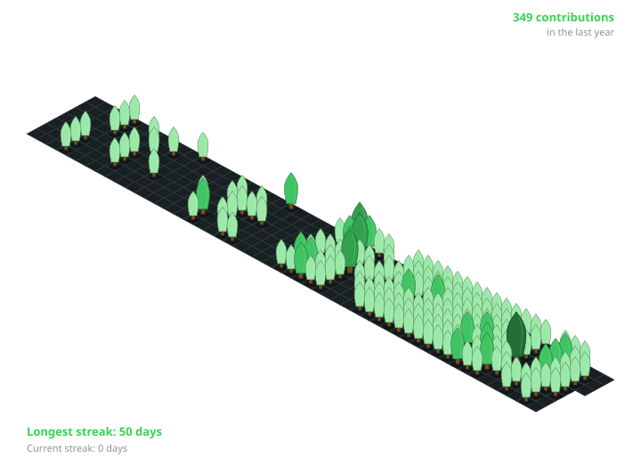

  

  

  
  
  

  
  
  

---

## About

Computer Engineering student at **Thapar Institute of Engineering and Technology**, specializing in **Data Science**, with a strong focus on software engineering, backend architecture, full-stack product development, and applied AI/ML.

I enjoy taking systems from **idea → architecture → implementation → deployment**, with hands-on experience building REST APIs, relational and NoSQL data models, machine learning pipelines, Retrieval-Augmented Generation systems, browser automation workflows, and containerized deployments.

My engineering interests sit at the intersection of:

- **Software Engineering** — scalable APIs, clean architecture, reusable systems, authentication, validation, and production workflows
- **Full-Stack Development** — React.js, Node.js, Express.js, PostgreSQL, MongoDB, Prisma
- **AI / ML** — RAG, semantic search, embeddings, computer vision, OCR, classification, NLP workflows
- **Product Engineering** — turning technical capabilities into complete, usable applications
- **DevOps & Cloud** — Docker, CI/CD, Nginx, AWS, deployment automation

### Open To

**Software Engineering · Backend Engineering · Full-Stack Engineering · AI/ML Engineering · DevOps · Product Engineering**

---

## Tech Stack

### Languages

  

### Frontend

  

### Backend & Databases

  

### Cloud

  

### DevOps

  

### Development & Tooling

  

---

## AI / ML Expertise

| Domain | Proficiency | Details |
|---|---|---|
| Retrieval-Augmented Generation | Advanced | Document ingestion, chunking, embeddings, vector search, conversational retrieval |
| Machine Learning | Intermediate–Advanced | Classification pipelines, feature engineering, model training, confidence-based predictions |
| NLP / LLM Applications | Intermediate–Advanced | Semantic search, LLM response generation, prompt-based extraction, AI-assisted workflows |
| Computer Vision | Intermediate | OpenCV preprocessing, image cleaning, OCR pipelines |
| OCR & Document Processing | Intermediate–Advanced | Tesseract OCR, image preprocessing, structured receipt extraction |
| Data Analytics | Advanced | Pandas, visualization, exploratory analysis, dashboard-oriented analytics |
| Deep Learning | Intermediate | PyTorch, TensorFlow, Keras, model experimentation |

---

## Featured Projects

<strong>🧠 Enterprise Knowledge Assistant</strong>

### Enterprise Knowledge Assistant

A three-service **Retrieval-Augmented Generation platform** for document ingestion, semantic retrieval, conversational AI, and persistent multi-turn conversations.

| Category | Details |
|---|---|
| **Stack** | React.js · Node.js · MongoDB · FastAPI · Sentence Transformers · RAG |
| **Scale** | 7 REST API endpoints · 384-dimensional embeddings |
| **Performance** | Chunk-based semantic retrieval with MongoDB Atlas Vector Search |
| **Security** | Service-separated architecture with backend-controlled data access |
| **Impact** | Converts unstructured documents into searchable conversational knowledge |
| **Repository** | [GitHub](https://github.com/Chirag-12-06/Enterprise-Knowledge-Assistant) |

### Engineering Highlights

- Designed a **three-service architecture** separating frontend, Node.js application logic, and Python embedding workloads.
- Built **7 REST endpoints** covering document ingestion, semantic search, chat, and conversation management.
- Implemented an end-to-end RAG pipeline using **384-dimensional Sentence Transformer embeddings**.
- Indexed document chunks in **MongoDB Atlas Vector Search** for semantic retrieval.
- Added **LLM-based answer generation** using retrieved contextual chunks.
- Implemented **persistent multi-turn conversations** using stored message and conversation records.
- Deployed a working production-facing frontend for interactive knowledge retrieval.

**Live Demo:** (https://enterprise-knowledge-assistant-iota.vercel.app)

---

<strong>💰 BudgetWise</strong>

### BudgetWise

A full-stack **expense management platform** combining financial tracking, analytics, recurring transactions, machine learning, and automated receipt processing.

| Category | Details |
|---|---|
| **Stack** | React.js · Node.js · PostgreSQL · Prisma · Scikit-learn · OpenCV · Tesseract OCR |
| **Scale** | 18 REST API endpoints · 4 recurrence frequencies · 3 end conditions |
| **Performance** | ML-powered categorization with confidence-based prediction |
| **Security** | Authenticated backend architecture with database-backed user data |
| **Impact** | Automated expense classification and receipt-to-expense workflows |
| **Repository** | [GitHub](https://github.com/Chirag-12-06/Budgetwise) |

### Engineering Highlights

- Built **18 REST API endpoints** covering authentication, expenses, analytics, and recurring transactions.
- Implemented recurring expenses across **4 frequencies** with **3 configurable end conditions**.
- Developed a **Scikit-learn category prediction pipeline** with user-specific model training after **10+ expenses**.
- Added a **0.6 confidence threshold** to control automated category prediction.
- Built receipt processing using **OpenCV + Tesseract OCR + LLM-based extraction**.
- Converted receipt images into structured expense data for downstream processing.
- Added analytical dashboards and expense visualizations for financial insights.
- Integrated PostgreSQL through **Prisma ORM** for structured data management.

**Live Demo:** https://budgetwise-aka2.vercel.app

---

<strong>🌐 Portify</strong>

### Portify

A full-stack **portfolio management platform** with independent administrative and public applications for managing professional profile data.

| Category | Details |
|---|---|
| **Stack** | React.js · Node.js · Express · PostgreSQL · Prisma · JWT · GitHub API |
| **Scale** | 3 applications · 14 admin modules · 12 public modules · 70+ REST endpoints |
| **Performance** | Search, filtering, pagination, and structured API workflows |
| **Security** | JWT authentication · HTTP-only cookies · role-based authorization · token expiry · login-attempt limiting |
| **Impact** | Centralized portfolio content management with reusable admin workflows |
| **Repository** | [GitHub](https://github.com/Chirag-12-06) |

### Engineering Highlights

- Architected **3 applications** across public and administrative workflows.
- Built **14 admin modules** and **12 public modules** for portfolio management.
- Designed a PostgreSQL schema containing **15 Prisma models and 5 join tables**.
- Implemented **70+ REST API endpoints** across portfolio domains.
- Added **JWT authentication** with HTTP-only cookies and role-based authorization.
- Implemented token expiry handling and **login-attempt limiting**.
- Added **Zod validation**, search, filtering, and pagination.
- Integrated the **GitHub API** for custom contribution heatmap data.
- Established a reusable backend architecture around **Prisma → validation → service → controller → route** workflows.

---

<strong>🚀 DeployFlow</strong>

### DeployFlow

A containerized full-stack application demonstrating **Docker-based deployment, reverse proxy configuration, and CI/CD automation**.

| Category | Details |
|---|---|
| **Stack** | Docker · Docker Compose · GitHub Actions · AWS EC2 · Nginx · PostgreSQL |
| **Scale** | Multi-service React + Node.js + PostgreSQL deployment |
| **Performance** | Containerized services with isolated runtime environments |
| **Security** | Environment-based configuration and service isolation |
| **Impact** | Automated application delivery from source control to cloud deployment |
| **Repository** | [GitHub](https://github.com/Chirag-12-06/DeployFlow) |

### Engineering Highlights

- Containerized a **React + Node.js + PostgreSQL** application with Docker and Docker Compose.
- Configured isolated application services and **persistent PostgreSQL volumes**.
- Implemented environment-based runtime configuration.
- Configured **Nginx as a reverse proxy** for production traffic routing.
- Built a **GitHub Actions CI/CD pipeline** for automated testing, image builds, and deployment.
- Deployed the application to **AWS EC2**.

---

<strong>📊 Streamlit Sentiment Dashboard</strong>

### Streamlit Sentiment Dashboard

An interactive sentiment analysis dashboard built around **14,608 tweets from 6 major US airlines**.

| Category | Details |
|---|---|
| **Stack** | Python · Streamlit · Plotly · Pandas |
| **Scale** | 14,608 tweets · 6 airlines |
| **Performance** | Interactive filtering and visual exploration |
| **Security** | Local analytical workflow with no authentication layer required |
| **Impact** | Explorable sentiment insights through interactive dashboards |
| **Repository** | [GitHub](https://github.com/Chirag-12-06) |

### Engineering Highlights

- Analyzed sentiment distribution across airlines.
- Identified **63% negative, 21% neutral, and 16% positive** sentiment.
- Built interactive visualizations using **Plotly** and Streamlit.
- Added per-airline sentiment comparisons.
- Implemented sentiment-based word clouds.
- Added geolocation mapping and a random-tweet explorer.

---

## Experience

### Software Engineering Intern · Value Prospect Consulting

**May 2025 – July 2025**

Contributed to business-oriented software workflows, data processing, debugging, and feature delivery within a **5-member engineering team**.

- Automated **3 recurring data-processing tasks**, reducing manual processing time by approximately **25%**.
- Cleaned and structured **1,000+ business records** using database queries.
- Contributed to **4 feature deliverables** across existing workflows.
- Debugged and resolved **15+ reported issues**.
- Worked across software workflows involving data processing, reporting, and operational automation.

**Skills**

`Software Engineering` `SQL` `Data Processing` `Debugging` `Automation` `Team Collaboration`

---

## Achievements

| Recognition | Details |
|---|---|
| 🧩 **LeetCode** | Solved **750+ DSA problems** with a **1,450 contest rating** |
| 🎓 **Tier 2 Merit Scholarship** | Awarded at **Thapar Institute of Engineering and Technology** based on JEE rank |
| 📚 **Academic Scholar** | Recognized as a **Scholar for 6 consecutive years** at Delhi Public School Ghaziabad |

---

## Certifications

### Google

**Google Data Analytics**

### Coursera

**Build a CI/CD Pipeline with Docker: From Code to Deployment**

### DeepLearning.AI

**Structuring Machine Learning Projects**

### Duke University

**Introduction to Retrieval Augmented Generation (RAG)**

### NVIDIA / Whizlabs

**NVIDIA: Fundamentals of Deep Learning**

---

## Coding Profiles

---

## GitHub Analytics

  
  

  

---

## Contribution Activity

---

## Contribution Snake

  

---

## Current Focus

Learning:
  - Advanced backend architecture
  - System design
  - RAG and LLM application engineering
  - Cloud and DevOps workflows
  - Machine learning engineering

Building:
  - AI-powered applications
  - Production-oriented full-stack systems
  - Developer automation workflows
  - Data-driven products

Exploring:
  - Vector search and semantic retrieval
  - Distributed application architecture
  - Intelligent developer tooling
  - Scalable deployment patterns

Open To:
  - Software Engineering
  - Backend Engineering
  - Full-Stack Engineering
  - AI/ML Engineering
  - DevOps and Product Engineering

---

## Connect

  <strong>Build it. Break it. Understand it. Build it better.</strong>

  

